# Mission_yunsoungbin
# 필수과제 요구사항
- 게시판 관련 기능
- 게시글 관련 기능
- 댓글 관련 기능

- #localhost:9090으로 접속해야 한다.

# 게시판 관련 기능
 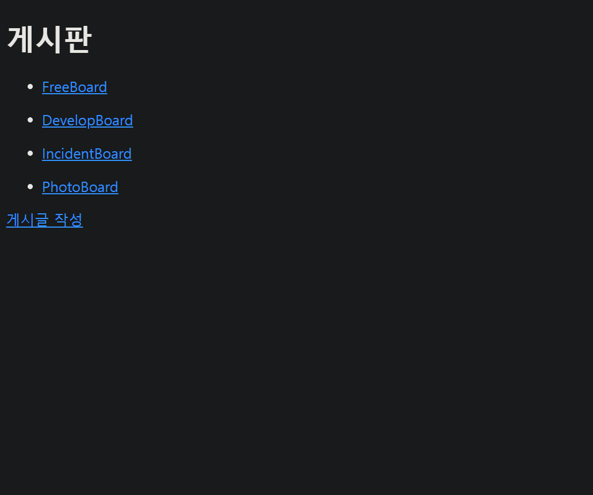

localhost:9090/boards로 들어가면 게시판 종류와 게시글을 생성할 수 있는 페이지가 출력된다.

 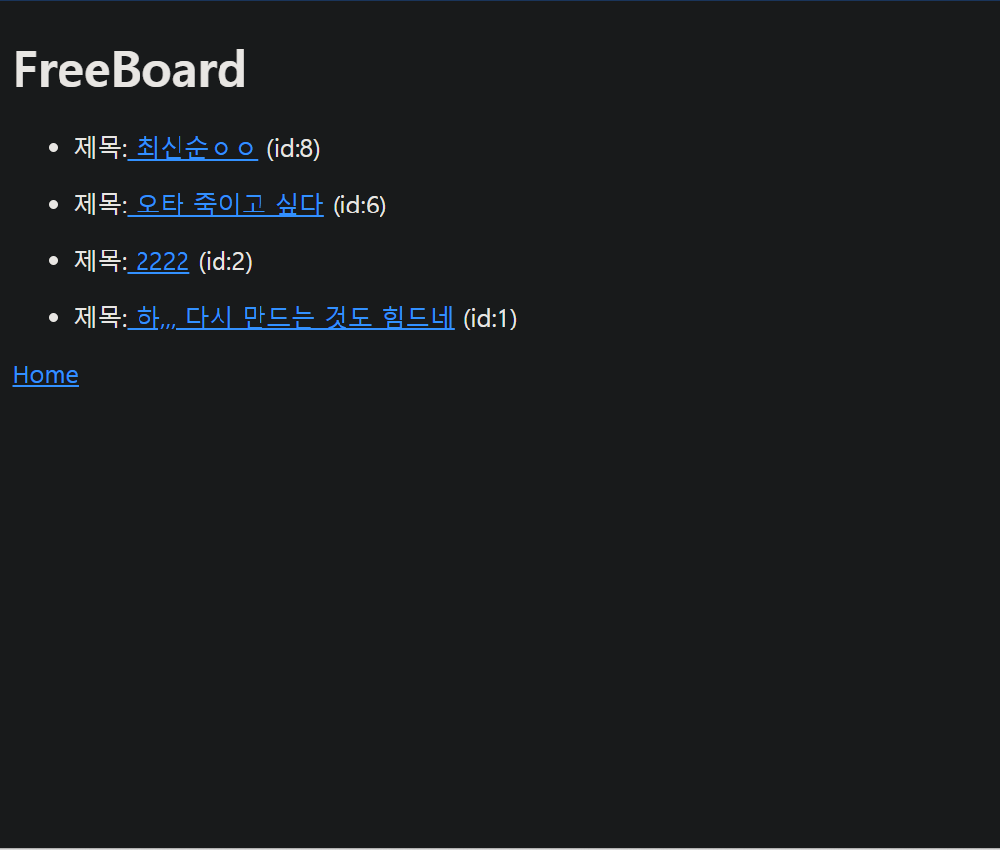
 원하는 게시판을 클릭하면 그 게시판의 게시글이 최신글부터 출력된다.


 # 게시글 관련 기능

 제목을 클릭하면 그 제목과 내용이 단일화면으로 출력된다.
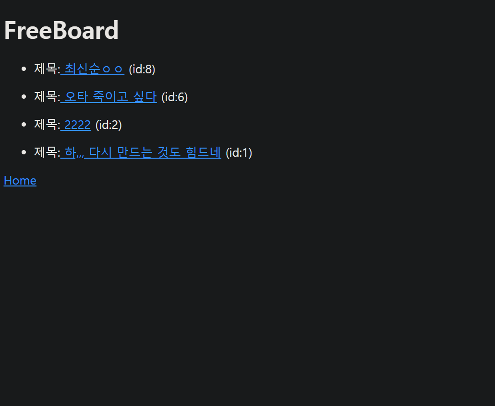
 
게시글이 없으면 NO Title Here이 출력된다.
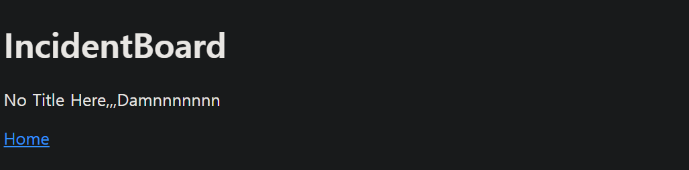

 제목, 내용으로 구성되어 있다, 수정 및 삭제가 가능하다.
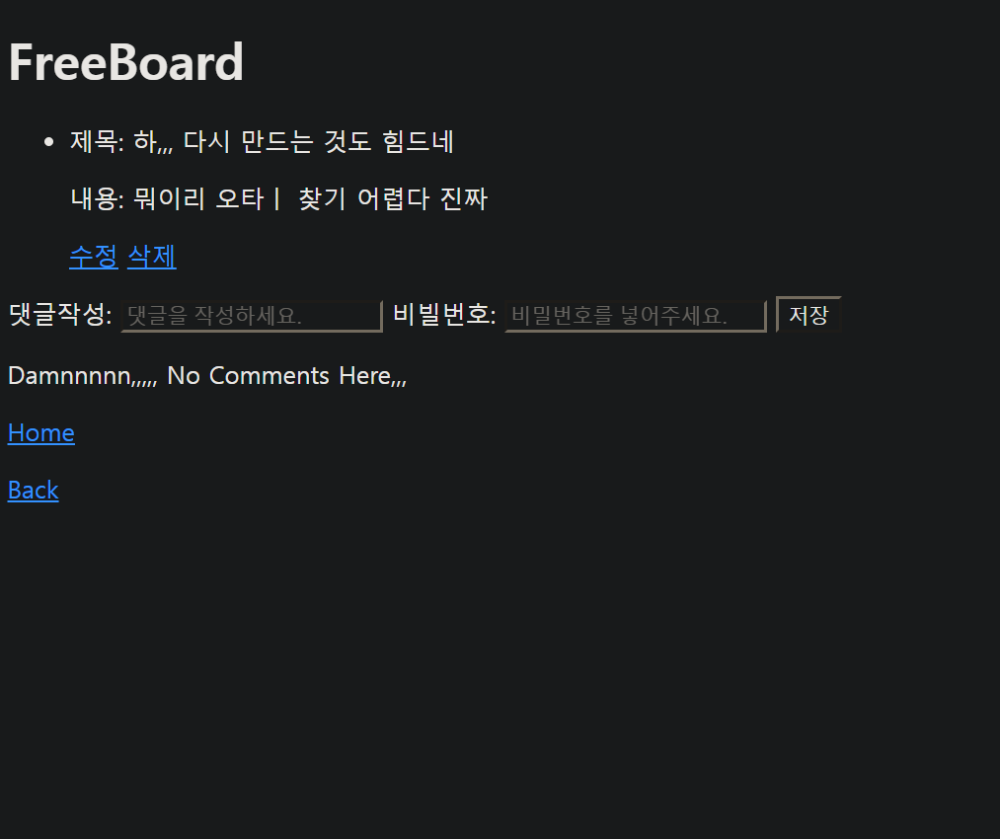

게시글 수정 비밀번호 확인.
 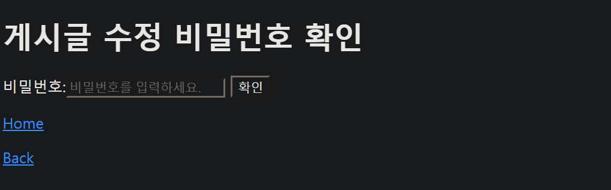
 

 게시글 삭제 비밀번호 확인
 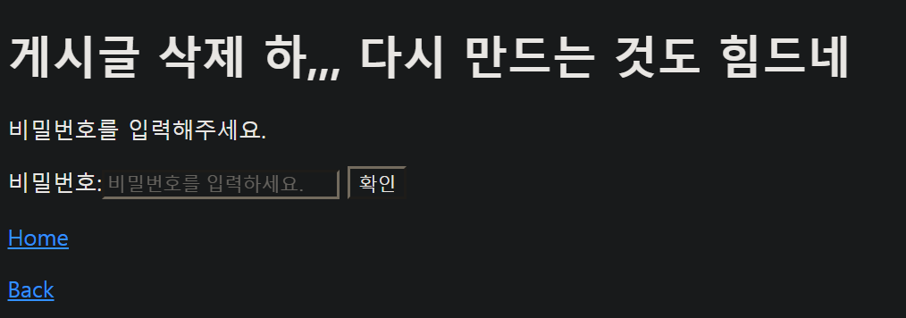
 

 수정 및 삭제를 원할 시 비밀번호를 입력을 해야 동작이 가능하다.

 비밀번호가 맞으면 삭제가 된다.

 비밀번호가 틀렸을 경우 계속 비밀번호를 요청한다.

 ```java
    //비밀번호 맞으면 삭제, 틀리면 계속 비밀번호 요청
    @PostMapping("/{id}/deleteArticlePassword")
    public String deleteArticlePassword(@PathVariable("id")Long id,
                                        @RequestParam("password")String password,
                                        Model model)
    {
        ArticlesEntity deleteArticlePassword = articlesService.findById(id);
        model.addAttribute("deletePassword", deleteArticlePassword);
        //비밀번호 일치 시 삭제
        if (password.equals(deleteArticlePassword.getPassword())){
            articlesService.deleteById(id);
            return "redirect:/boards";
            //비밀번호 일치하지 않으면 계속 비밀번호 요청.
        }else {
            return "ArticlesHtml/checkDeletePassword";
        }
    }
 ```


- 게시판 작성
    
    게시글을 작성하는 페이지가 따로 존재한다.
    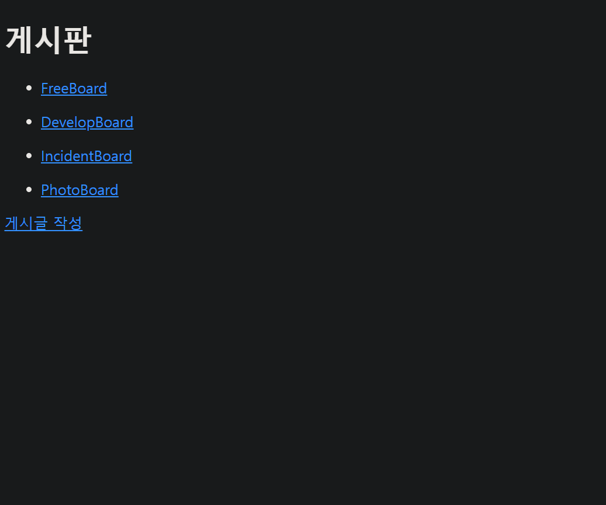

- 게시글 작성

     입력 후 저장하면 원하는 게시판에 저장이 된다.
    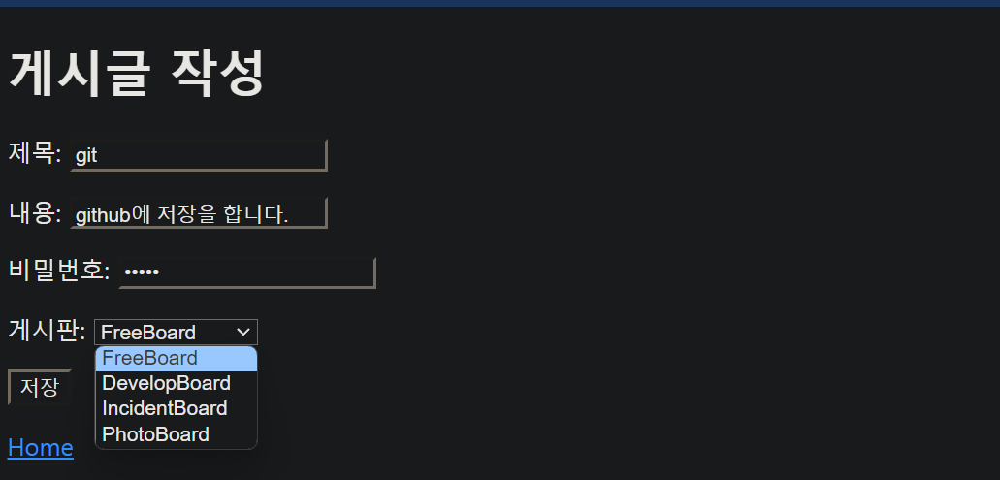
    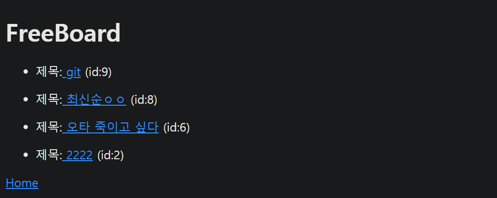


## 댓글 기능
댓글이 없으면 No Comments Here이 출력된다.
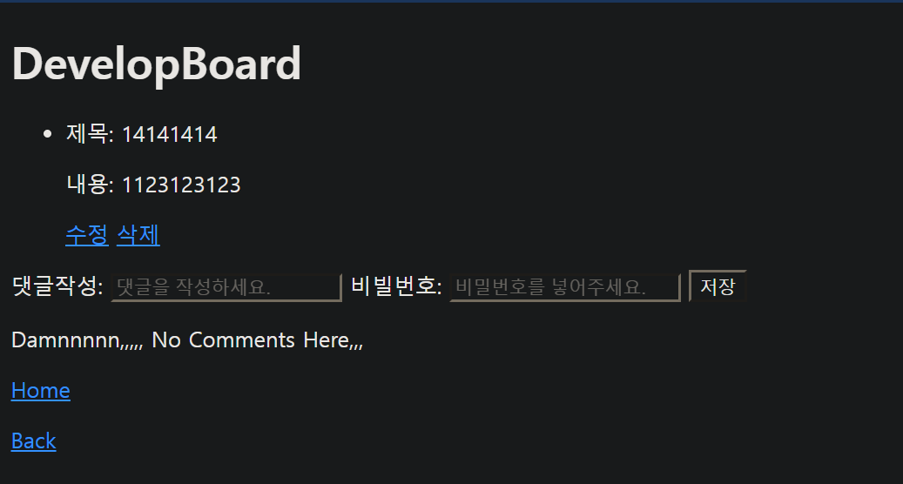

단일화면조회 페이지에 댓글이 있다.
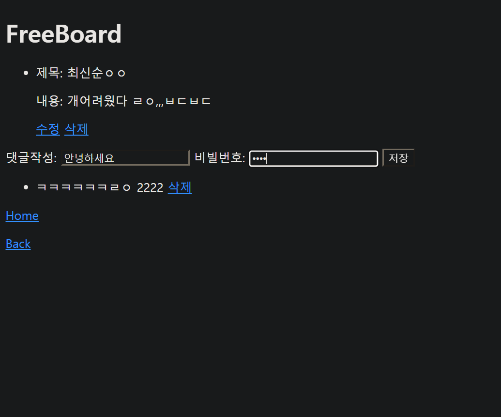

제목과 비밀번호를 입력하면 저장이 된다.
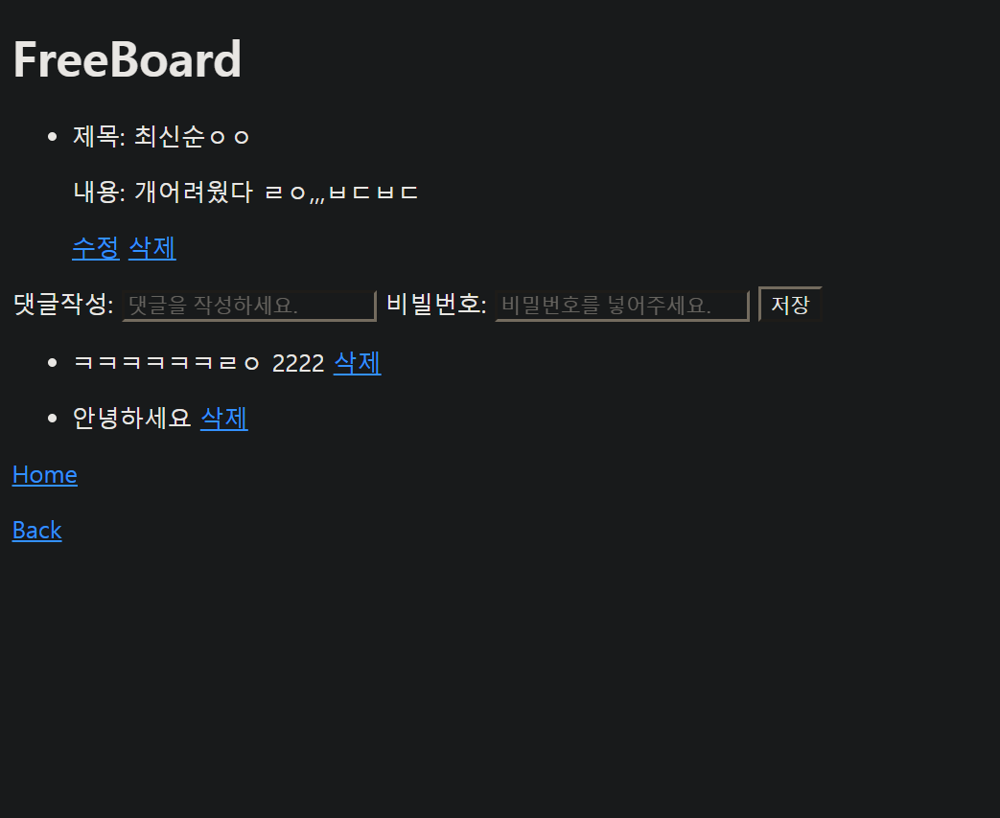

삭제링크를 누르면 비밀번호 입력 후 댓글을 삭제할 수 있다.
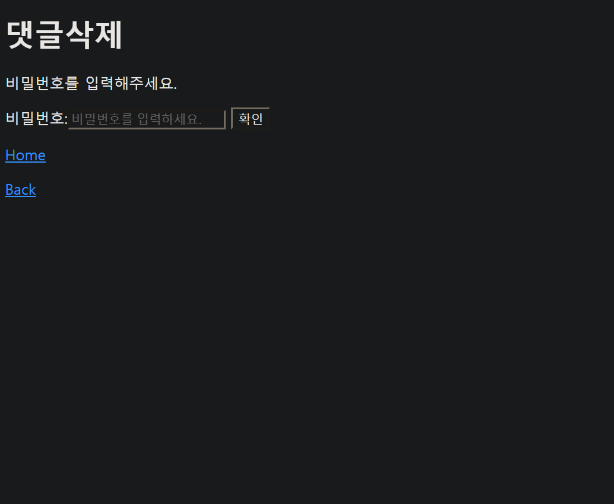
 
비밀번호가 맞으면 삭제한다.
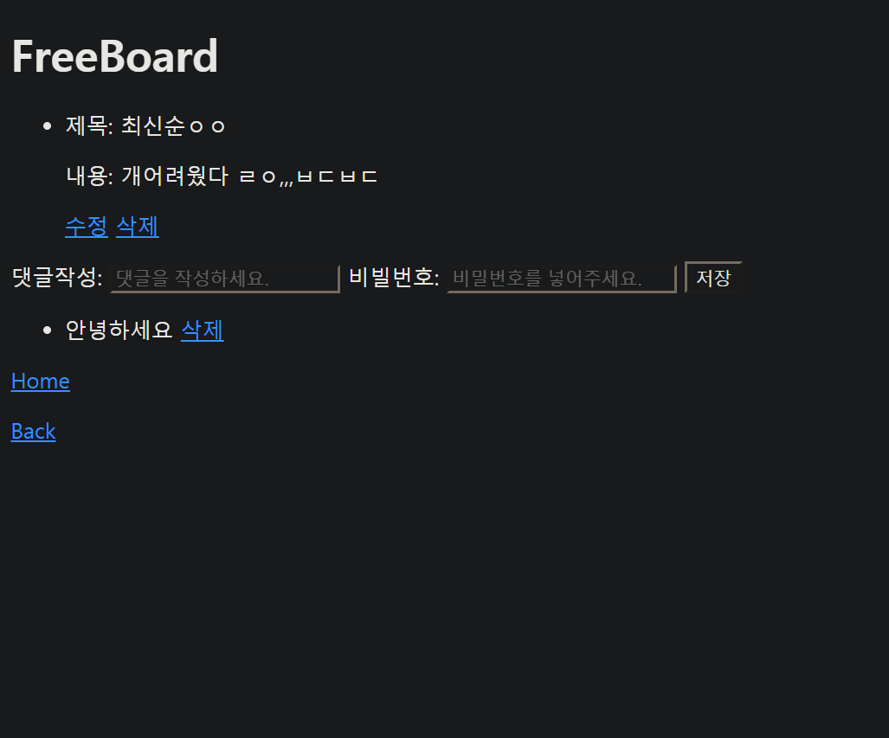

댓글 수정


댓글 삭제


비밀번호가 틀리면 계속 비밀번호를 요청한다.

```java
//return password.equals? 삭제완료 : 비밀번호입력창
    @PostMapping("/{articleId}/comment/{deleteId}/delete")
    public String delete(@PathVariable("articleId")Long articleId,
                         @PathVariable("deleteId")Long deleteId,
                         @RequestParam("password")String password,
                         Model model)//틀렸을 시 다시 비밀번호 페이지 사용하기 위함.
    {
        //삭제할 댓글 아이디로 비밀번호 알아내서 비교하기.
        CommentsEntity delete = commentsService.findById(deleteId);
        //일치하면 게시글 단일 조회화면으로 이동.
        if (password.equals(delete.getPassword())){
            commentsService.deleteId(deleteId);
            return String.format("redirect:/article/{articleId}/article",articleId);
            //일치하지 않으면 비밀번호 요청 반복.
        }else {
            //돌아갈 페이지에 필요한 데이터
            model.addAttribute("delete", commentsService.findById(deleteId));
            model.addAttribute("comment", articlesService.findById(articleId));
            return "CommentsHtml/checkDeletePassword";
        }
    }
```
