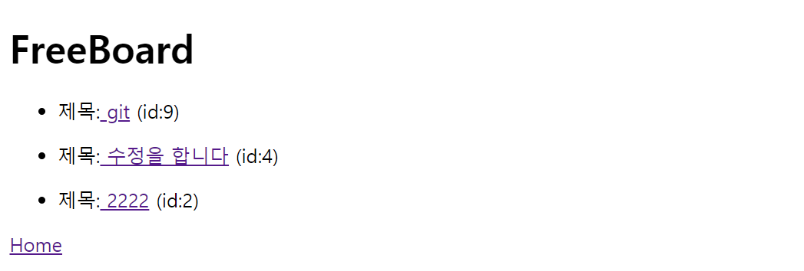

# Mission_yunsoungbin
## 필수과제 요구사항
- 게시판 관련 기능
- 게시글 관련 기능
- 댓글 관련 기능

## 주의사항
 - localhost:9090으로 접속해야 한다.

# 목차
- 기능구현
    1. 게시판 개발
    2. 게시글 개발
    3. 댓글기능 추가
- 개발 중 만난 오류
- 개발 중 만난 어려움


# 게시판 기능 구현
- 게시판 개발

    localhost:9090/boards로 들어가면 게시판 종류와 게시글을 생성할 수 있는 페이지가 출력된다.
    

    원하는 게시판을 클릭하면 그 게시판의 게시글이 최신글부터 출력된다.
     


- 게시글 개발

    게시글 타이틀만 보인다.

    제목을 클릭하면 그 제목과 내용이 단일화면으로 출력된다.
    
    만약 article이 없다면 no title here이 출력된다.
    

    - 게시글 단일화면

        제목, 내용으로 구성되어 있다, 수정 및 삭제가 가능하다.
        
    - 게시글 수정기능.

        게시글 수정을 누르면 수정을 하기 위해 비밀번호를 요청한다.  
        비밀번호가 틀리면 계속 비밀번호를 요청하고, 일치하면 수정 화면을 출력한다.
        
        그 후 수정화면이 나오고 원하는 입력을한다. 
       

    - 게시글 삭제기능.

        게시글 삭제를 누르면 삭제를 하기 위해 비밀번호를 요청한다.  
        비밀번호가 틀리면 계속 비밀번호를 요청하고, 일치하면 삭제한다.
        
        


    - 게시판 작성기능.
        
        게시글을 작성하는 페이지가 따로 존재한다.  
        게시글 작성을 클릭하면 게시글 작성 페이지가 나온다.
        

        입력 후 저장하면 원하는 게시판에 저장이 된다.
        
        


- 댓글 기능
    - 댓글 read

        댓글이 없으면 No Comments Here이 출력된다.  
        단일화면조회 페이지에 댓글이 있다.
        

    - 댓글 create

        제목과 비밀번호를 입력하면 저장이 된다.
        
        

    - 댓글 delete

        삭제링크를 누르면 비밀번호 입력 후 댓글을 삭제할 수 있다.  
        비밀번호가 맞으면 삭제하고, 틀리면 계속 비밀번호를 요청한다.
        
        


## 개발 중 만난 오류
그냥 다 오타 뿐이었음...

## 개발 중 만난 어려움
1. 비밀번호 설정 - 어떻게 해야할지 몰라서 컨트롤러에 혼자 생각으로 만들어 보았다.
 - 수정 비밀번호 코드
    ```java
    //게시글 Update 전 비밀번호 확인
        @GetMapping("/{id}/updatePassword")
        public String updatePassword(@PathVariable("id")Long id,
                                    Model model){
            //다음 페이지에 사용할 데이터를 계속 가져가기 위함.
            model.addAttribute("articleUpdate", articlesService.findById(id));
            return "ArticlesHtml/checkArticlePassword";
        }

        @PostMapping("/{id}/articlePassword")
        public String articleUpdatePassword(@PathVariable("id")Long id,
                                            @RequestParam("password")String password,
                                            Model model){
            //돌아갈 페이지에 필요한 테이터
            model.addAttribute("articleUpdate", articlesService.findById(id));
            //비밀번호 확인
            ArticlesEntity updatePassword = articlesService.findById(id);
            if (password.equals(updatePassword.getPassword())){
                //게시판 종류 수정 시 필요한 데이터
                List<BoardsEntity> boardList = boardsService.findAll();
                model.addAttribute("bordList", boardList);
                //맞으면 수정페이지로 이동
                return "/ArticlesHtml/articleUpdate";
            }else {//비밀번호 틀리면 계속 비밀번호 요청.
                return "ArticlesHtml/checkArticlePassword";
            }
        }
    ```
    비밀번호 페이지를 따로 만들어 비밀번호를 입력하고, 입력 받은 비밀번호가 그 아이디의 비밀번호와 맞는지 비교 후 맞으면 수정 페이지가 나오게 하고, 틀리면 계속 비밀번호를 요청 받게 하였다.

2. 오름차순

    게시글을 오름차순으로 하려고 하는데 findAll을 하지 않을거여서 만드는게 어려웠다. 
    게시글 제목 나열은 fk로 연결된 boardEntity 게시판에 있는데 제목은 articleEntity에 있기에 boardRepository에서 조작을 해야 했다. 
    ```java
    //게시판 내의 모든 게시글 제목을 가져온다, 내림차순
    @GetMapping("/{id}")
    public String board(@PathVariable("id")Long id,
                        Model model)
    {
        //내림차순을 위함. BoardsEntity.articlesEntityList 사용.
        List<ArticlesEntity> articlesForBoardInDescOrder = boardsService.getArticlesForBoardInDescOrder(id);
        model.addAttribute("h1", boardsService.findById(id));
        model.addAttribute("titleDesc", articlesForBoardInDescOrder);
        return "ArticlesHtml/showTitle";
    }
    ```
    ```java
    public List<ArticlesEntity> getArticlesForBoardInDescOrder(Long id) {
        BoardsEntity boardsEntity = boardsRepository.findById(id).orElse(null);

        if (boardsEntity != null) {
            // 내림차순으로 정렬된 articlesEntityList 반환
            List<ArticlesEntity> articlesEntityList = boardsEntity.getArticlesEntityList();
            articlesEntityList.sort((a1, a2) -> a2.getId().compareTo(a1.getId()));
            return articlesEntityList;
        } else {
            return Collections.emptyList();
        }
    }
    ```
    ```java
    public interface BoardsRepository extends JpaRepository<BoardsEntity, Long> {
    BoardsEntity findTopByIdOrderByArticlesEntityListIdDesc(Long id);
    }
    ```

3. 데이터베이스에서 pk와 fk를 만지는게 까다로웠다.
    ```java
    articlesEntity.setBoardsEntity(boardsRepository.findById(boardsEntity).orElse(null));
    ```
    예를들어 fk에 저장을 해야하는데 연결된 데이터베이스에 findById를 해서 optional을 사용하며 저장을 하는게 복잡하고 어려웠다.


